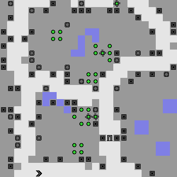
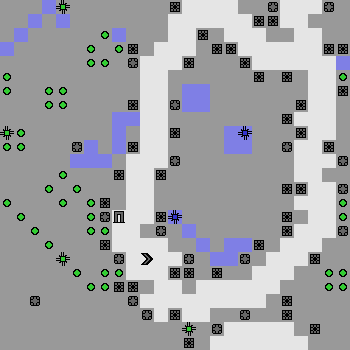
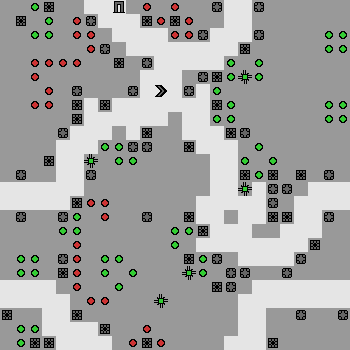
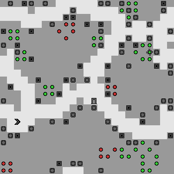

# SafeLife Videos

*This repo is a place to put interesting videos and images from SafeLife. This is just to keep the source code repo from getting bloated.*

## Initial training (SafeLife v0.1)

The initial agents were trained with no notion of side effects, so they end up being quite unsafe. Nonetheless, they do manage to occasionally complete a level without messing everything up. These are examples of (accidentally) safe and unsafe behaviors.

### Creating patterns

By far the easiest pattern for agents to create is the "block" (a 2x2 square of life). The agent can get pretty far using only block patterns, but it limits their score. Many levels are impossible to complete safely using only the block, even if the agent were trying to be safe.

Here's an example of safe behavior:

The agent focuses only on those patterns which are most easily accessible, and in this instance the easily accessible patterns didn't butt up against pre-existing patterns. The agent is able to build enough patterns to complete the level.

However, it's easy for the agent to disrupt a large area.

### Destroying patterns

In SafeLife, as in life, it's much easier to destroy things than it is to create them. The agent is quite good at getting rid of unwanted patterns, but it will almost always disrupt bystanders in the process.

Note that it's actually *easier* to destroy both the green and red patterns than to selectively prune only the red.

Very rarely, it will happen to destroy just what it intended and nothing more, but this is usually a fluke.

